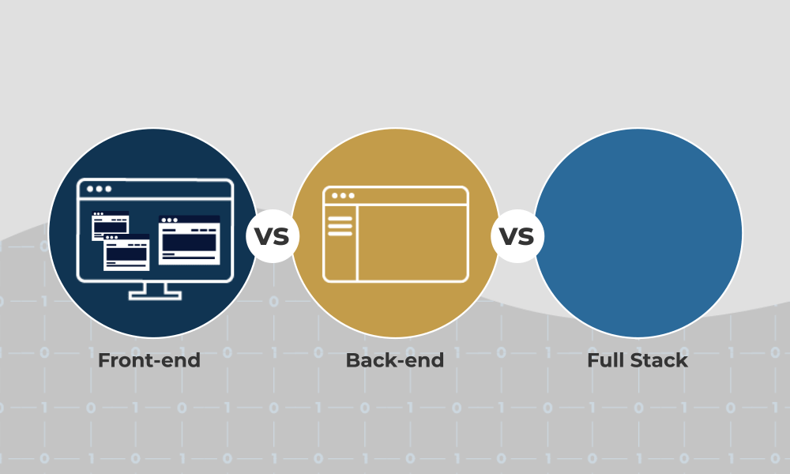
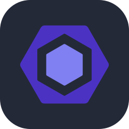
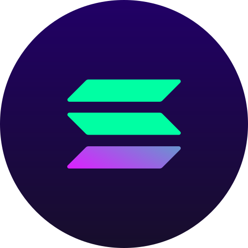
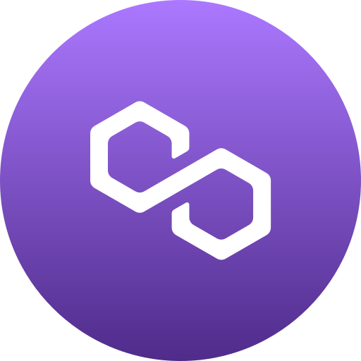
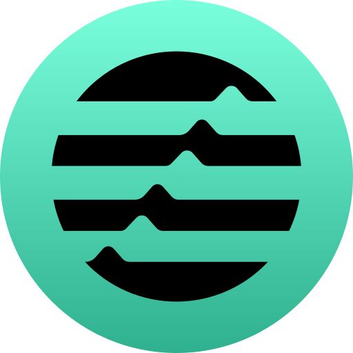
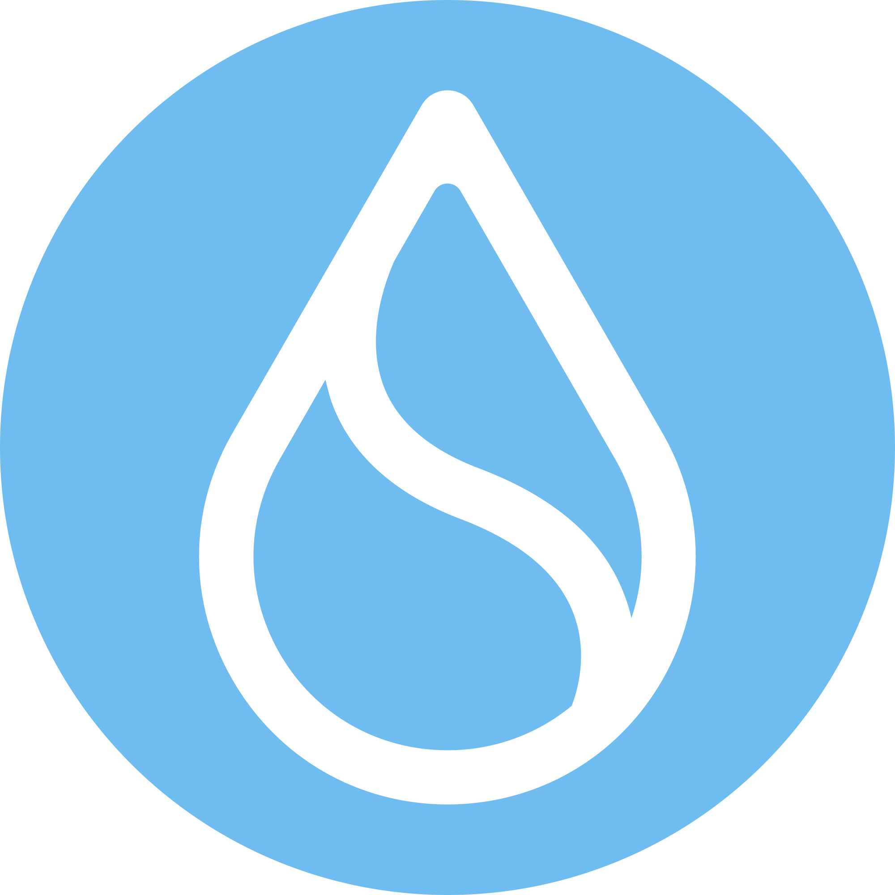
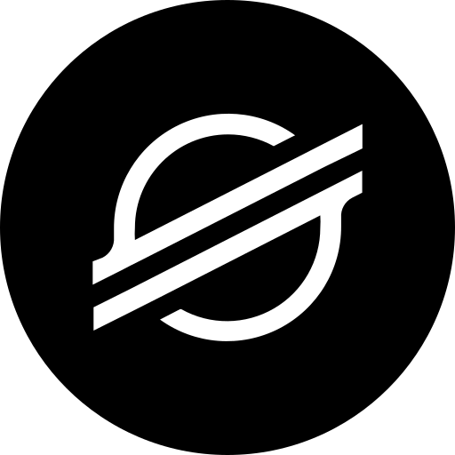
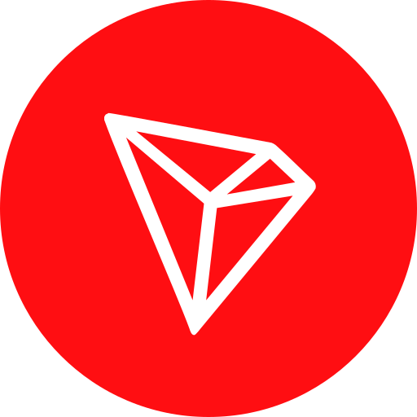

  

# **👋 Welcome to my github**

I’m a Full-Stack Developer who builds scalable, secure, and high-performance web applications from the ground up. I work across the entire stack—from clean, responsive front-ends to robust back-end systems, databases, and APIs.

I enjoy turning complex business requirements into reliable, maintainable solutions, with a strong focus on performance, security, and long-term architecture. I’m comfortable working independently or as part of a team, and I care deeply about writing clean code, testing features properly, and building systems that won’t need to be rewritten later.

Whether it’s developing MVPs, enterprise platforms, or improving existing systems, I focus on building software that actually solves real problems.

🚀 **Let’s build and push the boundaries of technology together.**

<table align="center">
  <tr>
    <!-- Languages -->
    <td align="center" width="40">
      
       Java&#8203;Script
    </td>
    <td align="center" width="40">
      
       Type&#8203;Script
    </td>
    <td align="center" width="40">
      
       Python
    </td>
    <td align="center" width="40">
      
       Go
    </td>
    <td align="center" width="40">
      
       Rust
    </td>
    <td align="center" width="40">
      
       Solidity
    </td>
    <td align="center" width="40">
      
       C++
    </td>
    <td align="center" width="40">
      
       Haskell
    </td>
    <td align="center" width="40">
      
       PHP
    </td>
    <td align="center" width="40">
      
       Ruby
    </td>
    <td align="center" width="40">
      
       Kotlin
    </td>
  </tr>
  <tr>
    <td align="center" width="40">
      
       Swift
    </td>
    <td align="center" width="40">
      
       HTML
    </td>
    <td align="center" width="40">
      
       CSS
    </td>
    <td align="center" width="40">
      
       SASS
    </td>
    <!-- Front-end -->
    <td align="center" width="40">
      
       React
    </td>
    <td align="center" width="40">
      
       Next.js
    </td>
    <td align="center" width="40">
      
       Vue.js
    </td>
    <td align="center" width="40">
      
       Nuxt.js
    </td>
    <td align="center" width="40">
      
       Angular
    </td>
    <td align="center" width="40">
      
       Svelte
    </td>
    <td align="center" width="40">
      
       Gatsby
    </td>
  </tr>
  <tr>
    <td align="center" width="40">
      
       Redux
    </td>
    <td align="center" width="40">
      
       Tailwind CSS
    </td>
    <td align="center" width="40">
      
       Boot&#8203;strap
    </td>
    <td align="center" width="40">
      
       Material UI
    </td>
    <td align="center" width="40">
      
       D3.js
    </td>
    <td align="center" width="40">
      
       Webpack
    </td>
    <td align="center" width="40">
      
       Vite
    </td>
    <td align="center" width="40">
      
       Figma
    </td>
    <td align="center" width="40">
      
       Sketch
    </td>
    <!-- Mobile -->
    <td align="center" width="40">
      
       React Native
    </td>
    <td align="center" width="40">
      
       Flutter
    </td>
  </tr>
  <tr>
    <td align="center" width="40">
      
       Android
    </td>
    <td align="center" width="40">
      
       Ionic
    </td>
    <!-- Back-end -->
    <td align="center" width="40">
      
       Node.js
    </td>
    <td align="center" width="40">
      
       Express
    </td>
    <td align="center" width="40">
      
       NestJS
    </td>
    <td align="center" width="40">
      
       Django
    </td>
    <td align="center" width="40">
      
       FastAPI
    </td>
    <td align="center" width="40">
      
       Flask
    </td>
    <td align="center" width="40">
      
       Laravel
    </td>
    <td align="center" width="40">
      
       Rails
    </td>
    <td align="center" width="40">
      
       GraphQL
    </td>
  </tr>
  <tr>
    <td align="center" width="40">
      
       Socket.io
    </td>
    <td align="center" width="40">
      
       Magento
    </td>
    <td align="center" width="40">
      
       Prisma
    </td>
    <td align="center" width="40">
      
       Sequelize
    </td>
    <!-- Databases -->
    <td align="center" width="40">
      
       Postgre&#8203;SQL
    </td>
    <td align="center" width="40">
      
       MySQL
    </td>
    <td align="center" width="40">
      
       Mongo&#8203;DB
    </td>
    <td align="center" width="40">
      
       Redis
    </td>
    <td align="center" width="40">
      
       Firebase
    </td>
    <td align="center" width="40">
      
       Supabase
    </td>
    <!-- Cloud & DevOps -->
    <td align="center" width="40">
      
       AWS
    </td>
  </tr>
  <tr>
    <td align="center" width="40">
      
       Docker
    </td>
    <td align="center" width="40">
      
       Kuber&#8203;netes
    </td>
    <td align="center" width="40">
      
       Nginx
    </td>
    <td align="center" width="40">
      
       Jenkins
    </td>
    <td align="center" width="40">
      
       Heroku
    </td>
    <td align="center" width="40">
      
       Digital&#8203;Ocean
    </td>
    <td align="center" width="40">
      
       Vercel
    </td>
    <td align="center" width="40">
      
       Netlify
    </td>
    <td align="center" width="40">
      
       Git
    </td>
    <td align="center" width="40">
      
       GitHub
    </td>
    <td align="center" width="40">
      
       Bitbucket
    </td>
  </tr>
  <tr>
    <!-- Testing -->
    <td align="center" width="40">
      
       Jest
    </td>
    <td align="center" width="40">
      
       Cypress
    </td>
    <td align="center" width="40">
      
       ESLint
    </td>
    <!-- AI -->
    <td align="center" width="40">
      
       Tensor&#8203;Flow
    </td>
    <td align="center" width="40">
      
       Lang&#8203;Chain
    </td>
    <td align="center" width="40">
      
       Hugging Face
    </td>
    <td align="center" width="40">
      
       Ollama
    </td>
    <td align="center" width="40">
      
       Deep&#8203;Seek
    </td>
    <td align="center" width="40">
      
       Vapi
    </td>
    <!-- Blockchain -->
    <td align="center" width="40">
      
       Ethereum
    </td>
    <td align="center" width="40">
      
       Bitcoin
    </td>
  </tr>
  <tr>
    <td align="center" width="40">
      
       Solana
    </td>
    <td align="center" width="40">
      
       BNB Chain
    </td>
    <td align="center" width="40">
      
       Polygon
    </td>
    <td align="center" width="40">
      
       Aptos
    </td>
    <td align="center" width="40">
      
       Sui
    </td>
    <td align="center" width="40">
      
       Polkadot
    </td>
    <td align="center" width="40">
      
       Cosmos
    </td>
    <td align="center" width="40">
      
       Stellar
    </td>
    <td align="center" width="40">
      
       TON
    </td>
    <td align="center" width="40">
      
       TRON
    </td>
    <td align="center" width="40">
      
       Foundry
    </td>
  </tr>
</table>
