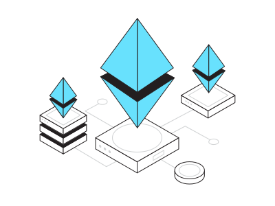

  

<h2 font-weight="bold">𝐒ervices 𝐒𝐞𝐭</h2>
<table>
  <tr>
    <td>
      
    </td>
    <td>
      
    </td>
    <td>
      
    </td>
    <td>
       
    </td>
    <td>
        
    </td>
    <td>
      
    </td>
    <td>
      
    </td>
    <td>
        
    </td>
    <td>
      
    </td>
    <td>
      
    </td>
    <td>
      
    </td>
    <td>
      
    </td>
    <td>
       
    </td>
    <td>
      
    </td>
  </tr>
  
  <tr>
    <td>
      
    </td>
    <td>
      
    </td>
    <td>
      
    </td>
    <td>
      
    </td>
    <td>
       
    </td>
    <td>
        
    </td>
    <td>
      
    </td>
    <td>
        
    </td>
    <td>
      
    </td>
    <td>
      
    </td>
    <td>
      
    </td>
    <td>
        
    </td>
    <td>
        
    </td>
    <td>
      
    </td>
  
  </tr>
  
  <tr>
    <td>
      
    </td>
    <td>
      
    </td>
    <td>
      
    </td>
    <td>
       
    </td>
    <td>
        
    </td>
    <td>
        
    </td>
    <td>
      
    </td>
    <td>
        
    </td>
    <td>
      
    </td>
    <td>
      
    </td>
    <td>
      
    </td>
    <td>
        
    </td>
    <td>
      
    </td>
    <td>
      
    </td>
  
  </tr>
</table>
